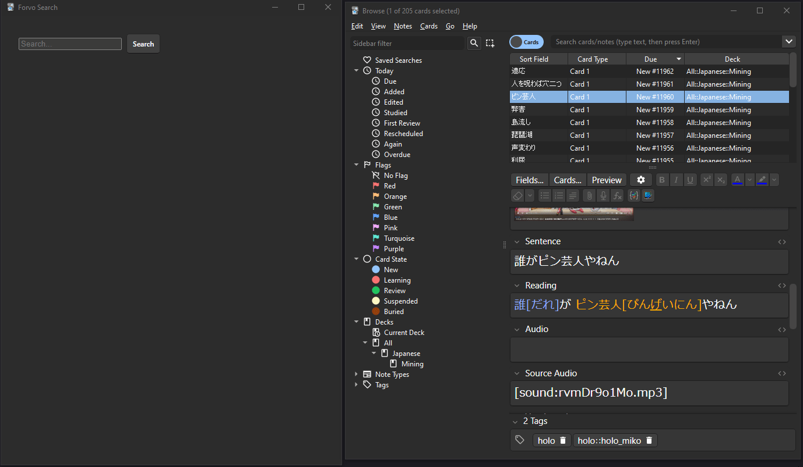

# Forvo Search

An Anki add-on for downloading Forvo audio files and copying them to your clipboard.

Open the add-on's window by going to `Tools -> Open Forvo Search`

Pressing the shortcut defined in `config.json` will search Forvo for the word currently in your clipboard. You can alternatively search using the search bar in the window.

The shortcut may not work if it overlaps with existing shortcuts. Make sure you choose a unique shortcut.

When the copy button is pressed, it will download the audio file to your current Anki profile's media folder and copy the audio file to your clipboard for easy pasting.

Changing `lang` in `config.json` will change the language searched. `ja` for Japanese, `ko` for Korean, etc.

This add-on was made to become familiar with the Anki add-on development process.

Only Qt6 is supported.